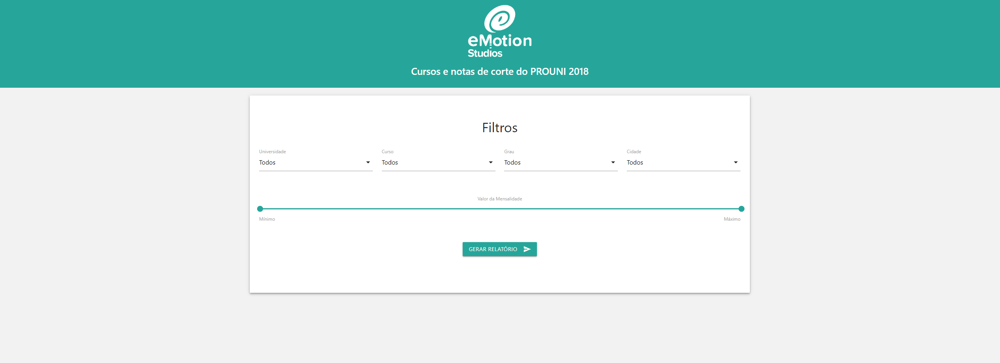
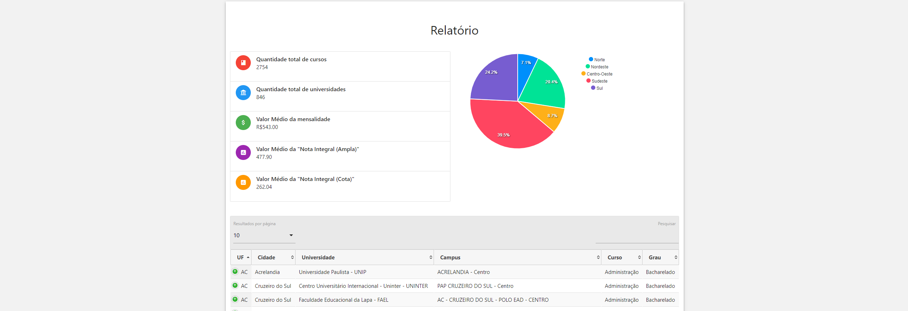

# Cursos e notas de corte do PROUNI 2018

Aplicação para consulta e análise de dados referentes ao PROUNI 2018, projetado por [eMotion Studios](http://emotionstudios.com.br/) e codificado por [Wenderson Jr.](https://github.com/wendej).

Esta aplicação utiliza a [API](https://brasil.io/api/dataset/cursos-prouni) da Brasil IO.





## Conteúdo

- [Estrutura de pastas e arquivos](#estrutura-de-pastas-e-arquivos)
- [Requisitos](#requisitos)
- [Como começar](#como-começar)

## Estrutura de pastas e arquivos

```
./
├── index.html
├── package-lock.json
├── package.json
├── README.md
|
├── css/                                
|   ├── materialize.css
|   |── nouislider.css
|   └── style.css
|
├── js/                                
|   ├── charts.js
|   |── forms.js
|   |── materialize.js
│   |── nouislider.js
│   |── scripts.js
│   └── tabela.js
|
└── img/                                
    ├── loading.gif
    |── logo.png
    |── shortcut.png
    |── notfound.png
    |── print1.png
    └── print2.png


```

## Requisitos

- [Node.js](http://nodejs.org/)


## Como começar

* Faça a instalação do _npm_.
* Faça a instalação das dependências da Aplicação contidas no `package-lock.json` executando o comando: `npm install`.
